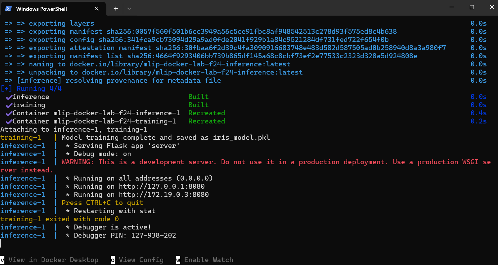
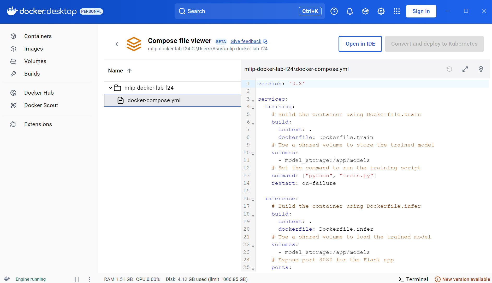

# Lab 5: Containerizing with Docker

## Deliverables

- [ ] Setup Docker on your system
- [ ] Containerize training the ML Model
- [ ] Containerize the Flask App for inference
- [ ] Train and deploy the machine learning model using Docker

